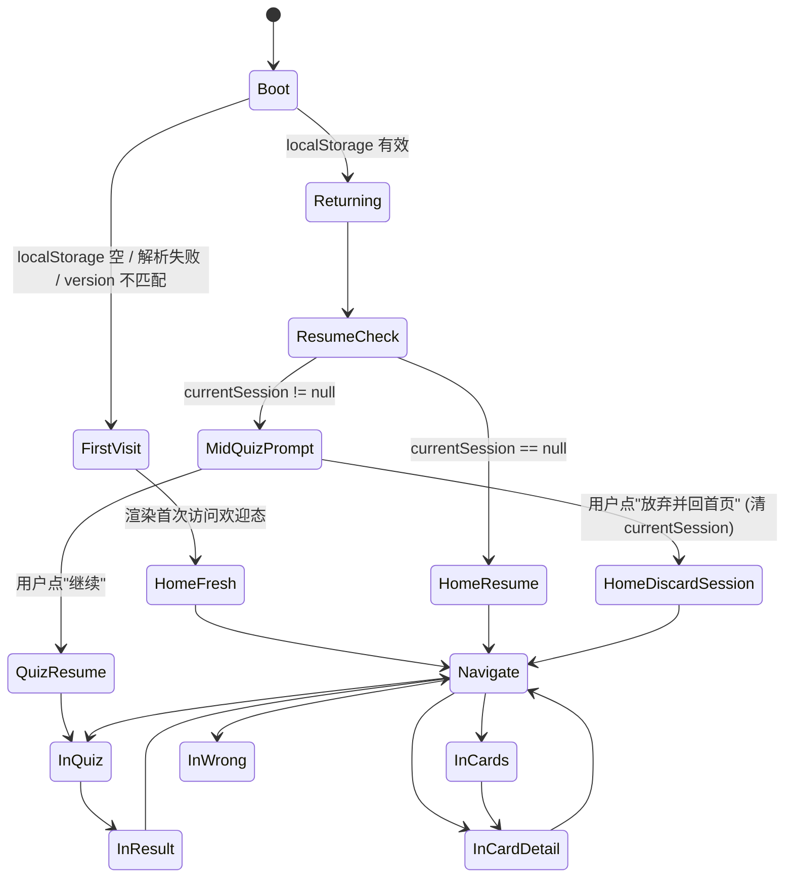
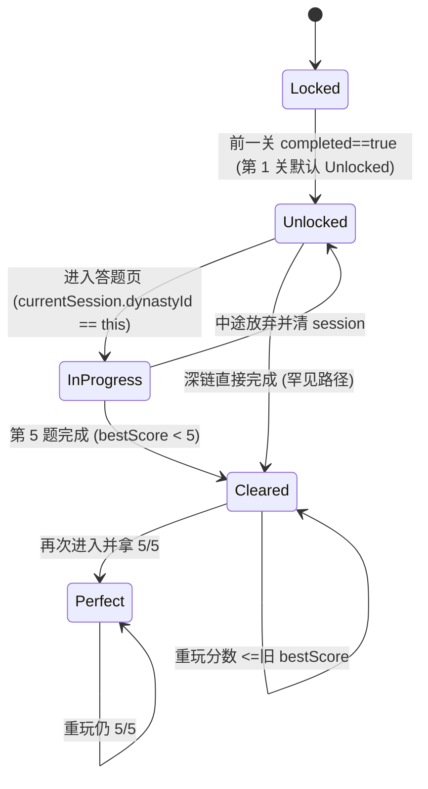
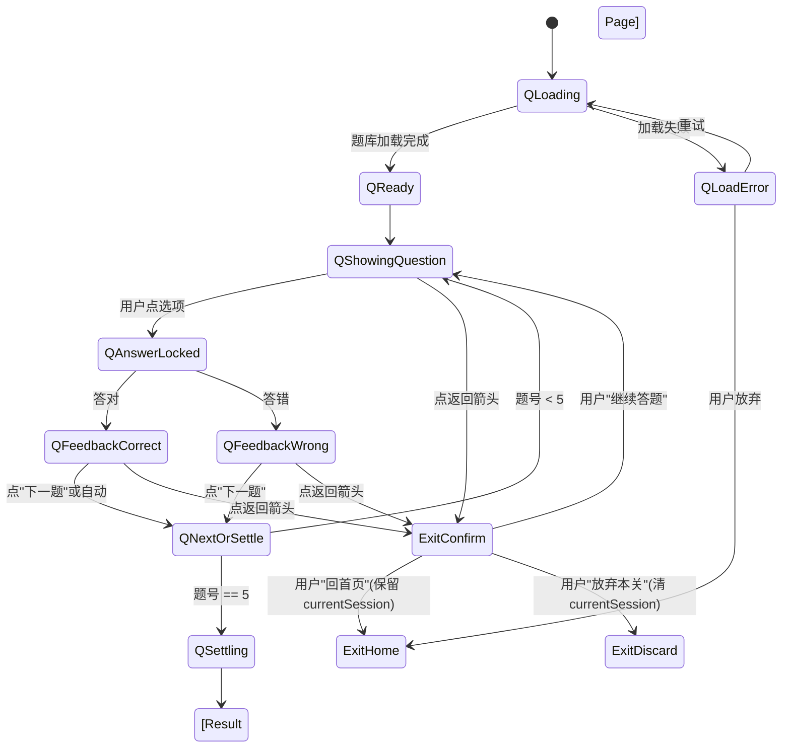
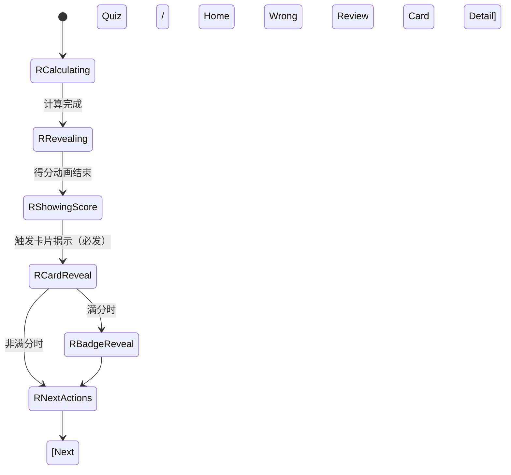
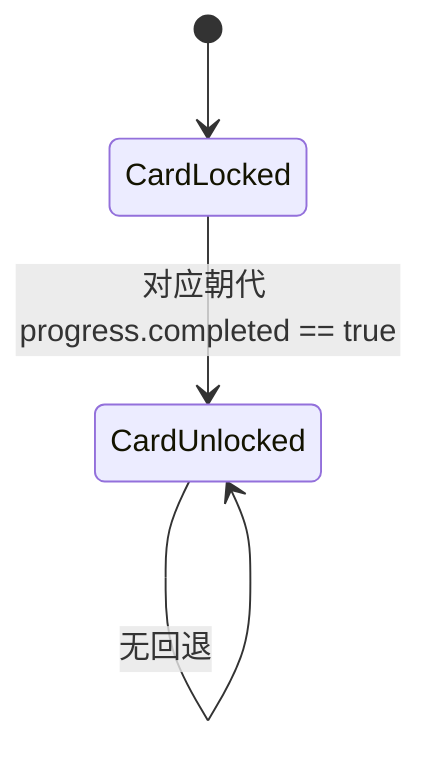
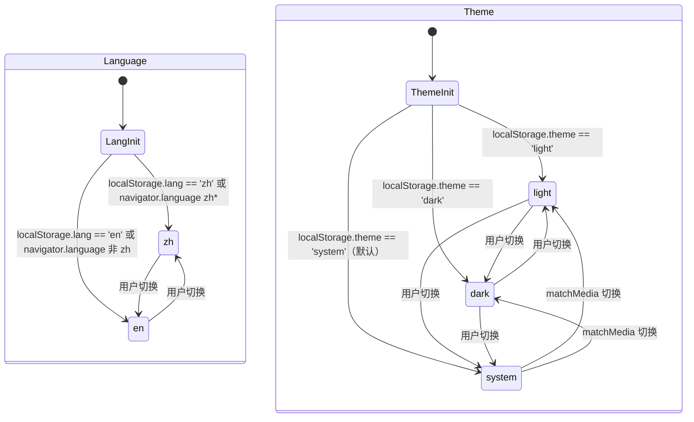

# 迷人的老祖宗 · 状态机（State Machine）

> Flow Architect 产出 · 版本 v1.0 · 2026-04-17
> 权威源：`PRODUCT.md` + `page-map.md`（同目录）
> 覆盖：关卡解锁、答题循环、结算、知识卡收集、错题、localStorage 恢复、语言/主题切换

---

## 0. localStorage 数据契约（状态根）

所有状态持久化均基于以下 schema（传给 r-frontend 作为真相源）：

```typescript
type StoredState = {
  version: number;              // schema 版本（破坏性变更 +1）
  lang: 'zh' | 'en';            // 默认跟随 navigator.language
  theme: 'light' | 'dark' | 'system';  // 默认 system
  progress: {
    [dynastyId: string]: {
      completed: boolean;       // 是否通关（完成 5 题即 true，无论对错）
      bestScore: number;        // 0-5
      attempts: number;         // 尝试次数
      perfectBadge: boolean;    // 是否曾满分
    }
  };
  unlockedCards: string[];      // 已解锁卡片 id 列表
  wrongQuestions: Array<{       // 累积错题
    questionId: string;
    dynastyId: string;
    myAnswerIdx: number;
    correctAnswerIdx: number;
    timestamp: number;
  }>;
  currentSession: {             // 未完成的答题会话（最多 1 个）
    dynastyId: string;
    currentQuestionIdx: number; // 0-4
    answers: Array<{ questionIdx: number; chosenIdx: number; correct: boolean }>;
    startedAt: number;
  } | null;
};
```

**兜底规则**：读 localStorage 时 try/catch；解析失败 → 按 `version` 降级或清零 → 视为"首次访问"状态。

---

## 1. 应用全局状态机（App Lifecycle）



| 状态 | 含义 | 触发事件 | 转移目标 | 副作用 |
|------|------|---------|---------|--------|
| `Boot` | 应用启动 | 任意 URL 加载 | FirstVisit / Returning | 读 localStorage，校验 version |
| `FirstVisit` | 首次访问（无历史） | localStorage 为空或无效 | HomeFresh | 初始化默认 StoredState 但不写入（懒写） |
| `Returning` | 回访（有历史） | localStorage 有效 | ResumeCheck | 读取 progress 等 |
| `ResumeCheck` | 检查是否有未完成会话 | Returning 完成 | HomeResume / MidQuizPrompt | 检查 `currentSession != null` |
| `MidQuizPrompt` | 提示用户是否继续未完成关卡 | 发现 currentSession | QuizResume / HomeDiscardSession | 只在**直访 `/`** 时弹；直访 `/quiz/:dyn` 时直接恢复（如 dyn 匹配）或清除不匹配的 session |
| `HomeFresh` | 首次访问首页状态 | FirstVisit | Navigate | 顶部显示"第一次来？点夏朝开始吧"引导 |
| `HomeResume` | 回访首页状态 | 无未完成会话 | Navigate | 常规首页渲染 |
| `QuizResume` | 恢复到上次答题点 | 用户确认继续 | InQuiz | 读 currentSession，跳到对应题号 |

---

## 2. 关卡解锁状态机（Dynasty Unlock）

每个朝代有 4 种互斥状态，由 `progress[dynastyId]` 与前一朝代状态决定。



| 状态 | 判定逻辑 | 视觉语言（交给 visual-designer） | 是否可点 |
|------|---------|-----------------------------|---------|
| `Locked` | 第 N 关 (N>1) 且 `progress[N-1].completed != true` | 灰调 + 锁 icon + "通关上一关解锁" | 否 |
| `Unlocked` | 已解锁未完成 | 正常色 + "开始" CTA 或"未开始" | 是 |
| `InProgress` | `currentSession.dynastyId == this` | 高亮描边 + "继续（X/5）" | 是（点即恢复） |
| `Cleared` | `progress[id].completed && bestScore < 5` | 完成标记 + "X/5" + 可重玩 | 是（重玩会清该关 currentSession） |
| `Perfect` | `progress[id].perfectBadge == true` | 满分徽章 + "5/5 ★" | 是（可重玩，不影响徽章） |

**第 1 关特殊规则**：无前置依赖，始终至少为 Unlocked。

**重玩规则**：点已 Cleared/Perfect 的关卡 → 二次确认弹层 → 清除该关 currentSession 残留 → 进入新 session；**bestScore 只增不减**，perfectBadge 一旦获得永不丢失。

---

## 3. 答题循环状态机（Quiz Loop）

这是核心交互，覆盖 1 关 = 5 题的完整循环。



| 状态 | 触发事件 | 转移目标 | 副作用 |
|------|---------|---------|--------|
| `QLoading` | 进入答题页 | QReady / QLoadError | fetch 题库 JSON（或内置） |
| `QReady` | 题库就绪 | QShowingQuestion | 初始化或恢复 currentSession |
| `QShowingQuestion` | 显示第 N 题 | QAnswerLocked | 渲染题干 + 4 选项；写 `currentSession.currentQuestionIdx` |
| `QAnswerLocked` | 用户点选项 | QFeedbackCorrect / QFeedbackWrong | 锁定所有选项（防重选）；append `currentSession.answers` |
| `QFeedbackCorrect` | 答对 | QNextOrSettle | 展示正确视觉 + 微动效（发现感）；解释文案 |
| `QFeedbackWrong` | 答错 | QNextOrSettle | 展示错误视觉（不羞辱配色）+ 标出正确答案 + 解释；**追加 wrongQuestions** |
| `QNextOrSettle` | 点"下一题" | QShowingQuestion / QSettling | 判断 idx+1 是否 == 5 |
| `QSettling` | 第 5 题反馈后 | → 结算页 | 计算分数；写 progress；清 currentSession；跳 `/result/:dyn` |
| `ExitConfirm` | 答题中点返回 | QShowingQuestion / ExitHome / ExitDiscard | 弹层三选项："继续答题 / 回首页保留进度 / 放弃本关" |
| `ExitHome` | 保留进度回首页 | - | 不清 currentSession；首页直访会触发 MidQuizPrompt |
| `ExitDiscard` | 放弃本关 | - | 清 currentSession；首页不再提示 |

**边界情况**：
- **刷新页面**：currentSession 已写，刷新后恢复到当前题号（选项状态不恢复，需重选当前题）
- **返回/前进浏览器按钮**：劫持 history，表现等同于点返回箭头
- **网络断线**（题库若为远程）：QLoadError 状态展示"再试一次"；题库建议打包进 bundle 避免此路径
- **答题时切换语言**：答题页禁止切语言（入口已移除）；直接改 URL ?lang=en 时当前题会语言切换但选项状态保持

---

## 4. 结算页状态机（Result）



| 状态 | 含义 | 副作用 |
|------|------|--------|
| `RCalculating` | 从 session.answers 计算 score | 极短暂 |
| `RRevealing` | 得分动画进行中 | visual-designer 定义的"得到感"微动效 |
| `RShowingScore` | 静态展示得分 | - |
| `RCardReveal` | 揭示新卡（通关即必发 1 张） | 写 `unlockedCards.push(cardId)`；若该卡已有（重玩情形），跳过 reveal |
| `RBadgeReveal` | 满分徽章浮现 | 写 `progress[id].perfectBadge = true`（仅首次，后续跳过） |
| `RNextActions` | 显示全部 CTA | 下一关可点仅当 `progress[nextId].completed == false || unlocked` |

**奖励发放规则（权威）**：

| 得分 | 卡片 | 徽章 | 错题回看入口 |
|------|------|------|-----------|
| 5/5 首次 | ✅ 发新卡 | ✅ 发徽章 | ❌ 本关无错题 |
| 5/5 重玩 | ⏭ 跳过（已有） | ⏭ 跳过（已有） | ❌ |
| 1-4/5 首次 | ✅ 发新卡 | ❌ | ✅ 显示入口 |
| 1-4/5 重玩 | ⏭ 跳过（已有） | ❌ | ✅ |
| 0/5 | ✅ 发新卡（仍算通关） | ❌ | ✅ |

---

## 5. 知识卡收集状态机（Card Collection）

每张卡片有 2 种状态，共 10 张卡（对应 10 关各 1 张）。



| 状态 | 视觉 | 可交互 |
|------|------|--------|
| `CardLocked` | 剪影 + 灰调 + "通关 XX 朝代解锁" | 点击无反应或轻提示 |
| `CardUnlocked` | 完整封面 + 朝代名 + 分类 tag | 点击进 L2 详情 |

**首次揭示**（`RCardReveal`）与**常规查看**（`/cards` 进入）使用不同动效：前者有"发现感"动画，后者直接展示。

---

## 6. 语言 / 主题切换状态机（全局横切）



| 事件 | 行为 | 约束 |
|------|------|------|
| 语言切换 | 更新 `localStorage.lang`；重新渲染当前页；URL 不变 | **答题页禁止切换**（入口已移除） |
| 主题切换 | 更新 `localStorage.theme`；`<html data-theme>` 切换；无闪烁（preload 逻辑由 r-frontend 实现） | 答题页可切换（仅视觉，不影响数据） |
| system 主题跟随 | 监听 `prefers-color-scheme` | 仅 theme == 'system' 时生效 |

---

## 7. 异常 / 边界情况汇总

| 场景 | 触发条件 | 应对策略 | 状态转移 |
|------|---------|---------|---------|
| **localStorage 被清空** | 用户清浏览器数据 / 隐私模式 | 识别为 FirstVisit；所有 progress 重置 | Boot → FirstVisit → HomeFresh |
| **localStorage 版本不匹配** | schema 升级 | 尝试迁移；失败则清零 + 提示"数据已重置" | Boot → FirstVisit（带 toast） |
| **localStorage 满 / 写入失败** | 极端情况 | try/catch；降级到内存态；toast 提示"进度可能无法保存" | 当前 session 继续 |
| **未完成关卡中途退出** | 关闭浏览器 / 切后台 / 点返回 | currentSession 保留；下次进 `/` 触发 MidQuizPrompt | Boot → ResumeCheck → MidQuizPrompt |
| **深链未解锁关卡** | URL 直访 `/quiz/:dyn`，dyn 尚未解锁 | 重定向 `/`，toast "先通关前面的朝代" | Boot → Navigate → `/` |
| **深链不存在的朝代** | URL 里 dynastyId 非法 | 重定向 `/`，toast "找不到这个朝代" | Boot → Navigate → `/` |
| **深链未解锁卡片** | URL 直访 `/card/:id`，卡未解锁 | 重定向 `/cards`，toast "这张卡还没解锁" | Boot → Navigate → `/cards` |
| **无错题时访问 /wrong** | wrongQuestions 为空 | 显示空态："太棒了，暂时没有要再看一眼的题" | - |
| **MVP 阶段题库缺失**（关卡 4-10） | 点未实现关卡 | 显示"即将上线"占位（MVP 阶段只做 3 关，但 10 关结构要展示） | Locked 视觉等价 |
| **浏览器不支持 localStorage** | 私密模式禁用存储 | 降级：内存态运行，顶栏 toast 提示"进度不会保存" | 正常运行但不持久化 |
| **同一浏览器多 tab** | 用户开 2 个 tab 答题 | storage 事件同步；后写的覆盖先写的（简单策略，MVP 不做冲突解决） | - |

---

## 8. 首次访问关键路径（High Priority Scenario）

```
User opens /
  └─ Boot
     └─ localStorage 空 → FirstVisit → HomeFresh
        (首页显示"欢迎"引导 + 第 1 关"夏"高亮可点)
        └─ User clicks 夏朝卡片
           └─ Navigate → /quiz/xia
              └─ QLoading → QReady → QShowingQuestion (Q1)
                 └─ User picks answer
                    └─ QAnswerLocked → QFeedbackCorrect/Wrong
                       └─ Click "下一题"
                          └─ QShowingQuestion (Q2) ... 循环到 Q5
                             └─ QSettling → /result/xia
                                └─ RCalculating → RRevealing → RShowingScore
                                   └─ RCardReveal (发第 1 张卡，必发)
                                      └─ RBadgeReveal (若 5/5)
                                         └─ RNextActions
                                            └─ Click 下一关 → /quiz/shang
                                            or 回图谱 → /
```

**关键校验点**（交给 r-qa）：
1. 首次访问能否 2 步进第 1 关（首页落地 → 点夏朝）
2. 第 1 关 5 题完整走通
3. 结算页必发 1 张卡（非满分也有），满分多发徽章
4. 第 2 关（商）从 Locked → Unlocked 视觉变化
5. 错题回看入口仅在有错题时出现
6. 中途刷新能恢复到当前题号
7. 清 localStorage 后再访问能回到 FirstVisit

---

## 9. 下游交接

| 交给谁 | 用到本文件的什么 |
|--------|----------------|
| ix-designer | 第 3/4 节状态转移点 → 设计每个状态的微动效触发时机 |
| visual-designer | 第 2 节关卡状态视觉语言、第 5 节卡片状态视觉 |
| r-designer | 第 0 节 localStorage schema 作为数据契约 |
| r-pencil | 第 8 节首次访问路径作为演示脚本 |
| r-frontend | 全文（本文件是实现规范） |
| r-qa | 第 7 节异常表 + 第 8 节校验点 → 测试用例清单 |
